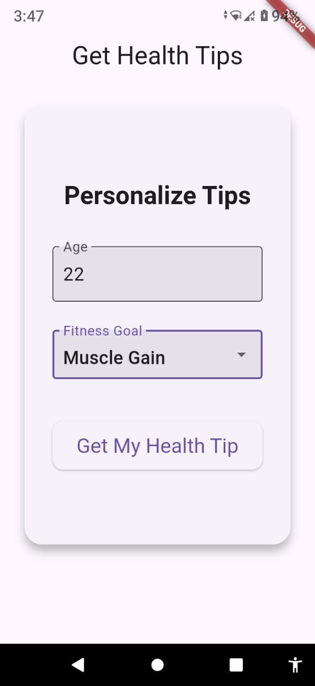

# **Health Tips App**  

A cross‑platform Flutter application that allows users to register their age and fitness goals, then receive personalized health tips via notifications.  

---

## **📸 App Preview**
|  |  |  |

---

## **🚀 Features**
- **User Registration**
  - Collects age and fitness goals.
  - Stores user details in Firestore.
- **Personalized Health Tips**
  - Generates tips based on age and fitness goal.
  - Sends them via notifications.
- **Cross‑Platform Notifications**
- **Firestore Integration**
  - Saves and retrieves user data securely.

---

## **📂 Project Structure**
```
lib/
  controller/
    registration_controller.dart
  screens/
    registration_screen.dart
  services/
    firestore_service.dart
    notification_service.dart
  utils/
    user_model.dart
  main.dart
```

---

## **⚙️ Setup Instructions**
### **1. Clone the Repository**
```bash
git clone https://github.com/Omnyanasr/health_tips.git
cd health_tips
```

### **2. Install Dependencies**
```bash
flutter pub get
```

### **3. Configure Firebase**
- Create a Firebase project in [Firebase Console](https://console.firebase.google.com/).
- Enable **Firestore**.
- Download:
  - `google-services.json` → place in `android/app/`
  - `GoogleService-Info.plist` → place in `ios/Runner/`

### **4. Run the App**
```bash
flutter run
```
